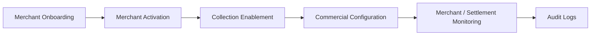
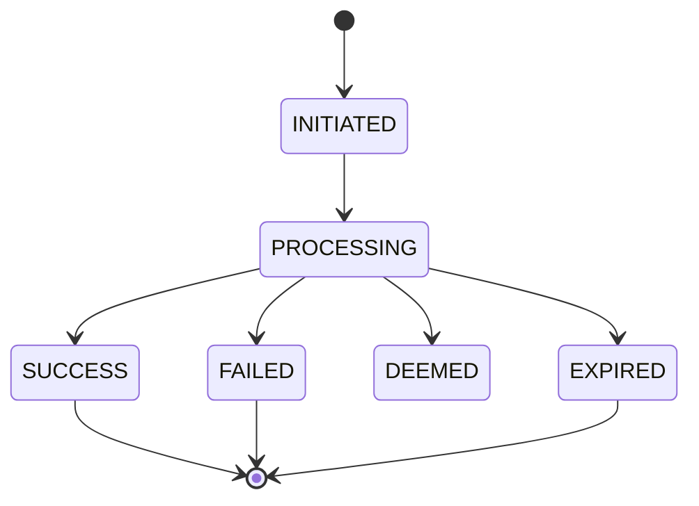
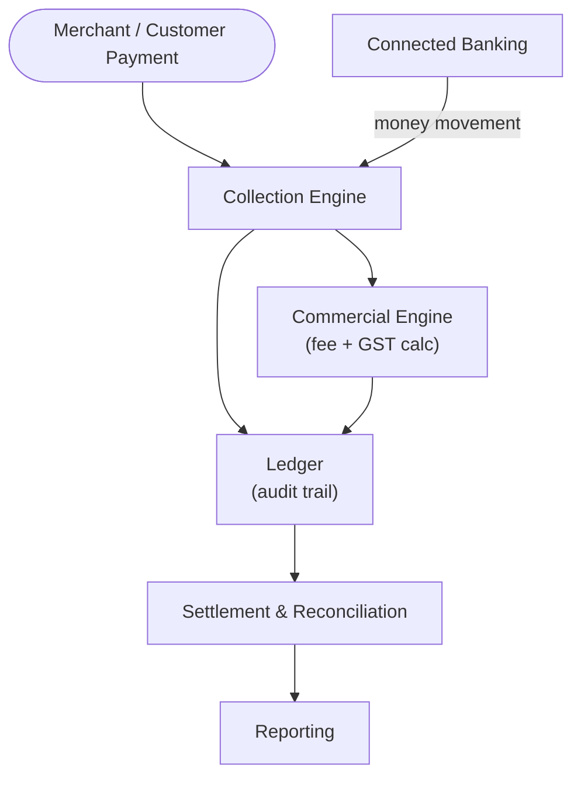
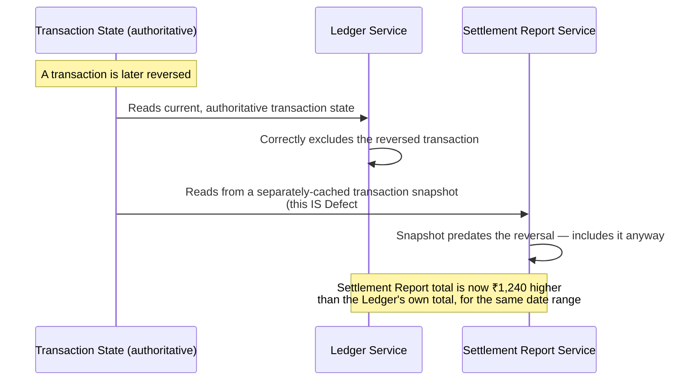

# Collection Engine — Architecture & Flow

> This is the internal, system-level "Tech Flow" view — state machines, admin flow, service
> interaction. For the customer/merchant-facing journey, see [`business-flow.md`](./business-flow.md).
> For the service-level (microservice) view behind these diagrams, see
> [`service-architecture.md`](./service-architecture.md). See [`README.md`](./README.md) for the
> full documentation map.
>
> Every diagram below is drawn in [Mermaid](https://mermaid.js.org/), which GitHub renders
> natively in-page — nothing here requires opening another site or tool to read it.

## Merchant Regression Flow (Primary End-to-End Scenario)

This is the single highest-priority path through the system — nearly every release regression
run starts here:


## Admin Flow



## Transaction Lifecycle States



- **SUCCESS** — payment completed, funds move toward settlement
- **FAILED** — payment rejected (e.g. insufficient funds, invalid VPA)
- **DEEMED** — payment status uncertain at the payment gateway/bank, requires reconciliation
- **EXPIRED** — payment window closed without a definitive response

## System Interaction Map



## The Real Mechanism Behind Defect #1 — Why "Ledger Entry Missing" Actually Happens

[`sample-defect-report.md`](../sample-defect-report.md) Defect #1 (a missing ledger debit for the
commercial fee) is the single most historically common defect theme for this module, per
[`service-architecture.md`](./service-architecture.md)'s own integration-boundary notes. Here's
why it keeps recurring, shown as a sequence rather than described in prose alone:

```mermaid
sequenceDiagram
    participant Pay as Payment Processing Service
    participant Settle as Settlement Calculation Service
    participant Ledger as Ledger Service

    Pay->>Pay: Transaction reaches SUCCESS
    Pay->>Settle: Trigger settlement calculation (async event)
    Pay->>Ledger: Trigger ledger write (separate async event)
    alt Both events fire reliably
        Settle->>Settle: Computes net settlement (gross - fee - GST)
        Ledger->>Ledger: Writes credit (gross) AND debit (fee) entries
        Note over Settle,Ledger: Settlement and Ledger agree — correct
    else Ledger-write event is dropped or fails silently
        Settle->>Settle: Still computes net settlement correctly
        Ledger->>Ledger: Writes ONLY the credit entry — debit never arrives<br/>(this IS Defect #1's actual root cause)
        Note over Settle,Ledger: Settlement total implies a fee was deducted;<br/>Ledger shows no matching debit — audit trail breaks
    end
```

**Why "same transaction, two separate async triggers" is the actual design flaw, not just bad
luck:** [`sample-defect-report.md`](../sample-defect-report.md)'s suggested fix — trigger both
from the same event, ideally atomically — is the right fix specifically *because* the diagram's
`else` branch shows the two services can silently disagree about what happened to the same
transaction whenever their two separate triggers don't both fire with the same reliability. A
system that triggers settlement calculation and the ledger write as two independent events has no
guarantee they stay consistent; one that derives both from a single atomic step (or has the
ledger write co-own the settlement calculation's own success) cannot drift apart this way.

## The Real Mechanism Behind Defect #3 — Two Services, Two Snapshots



**Why this is the same root shape as Defect #1, in a different pair of services:** both defects
are two services independently answering "what actually happened to this transaction" from two
different sources of truth that can silently fall out of sync. [`sample-defect-report.md`](../sample-defect-report.md)'s
fix for this one — generate the Settlement Report *from* the Ledger directly, rather than from an
independently-cached snapshot — removes the second source of truth entirely, which is the only
way to guarantee the two numbers can never disagree again.

## Why the Flow Order Matters for Testing

Each step in the merchant flow builds state that the next step depends on:

1. **Login** establishes the authenticated merchant session
2. **Dashboard** surfaces a summary that must match underlying transaction data
3. **Collection** is where new transactions are created/viewed
4. **Transaction Search** must correctly filter by status, date, and amount
5. **Transaction Details** must show the exact same data as search results — no drift
6. **Settlement** must reconcile to the transaction totals exactly
7. **Reports** must match settlement and transaction data byte-for-byte on export

This is why the regression suite (manual and automated) always walks this path in order rather
than testing each screen in isolation — most real-world defects in this module are **data
consistency issues between steps**, not isolated UI bugs, exactly as the two sequence diagrams
above demonstrate concretely.

**See also:** these steps are also where cross-screen [UI consistency](./ui-consistency.md)
issues surface most often (Section 4 above shows the same data on multiple screens); the concrete
test cases derived from this flow live in [`../regression-checklist.md`](../regression-checklist.md).
