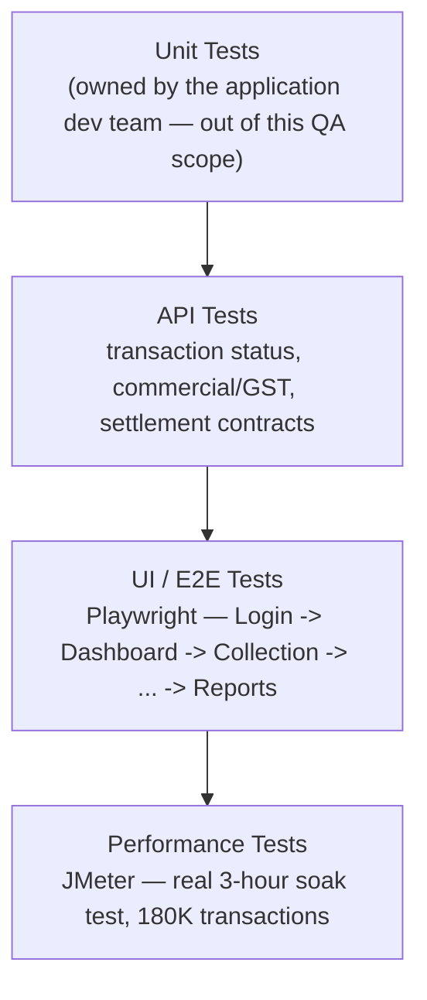
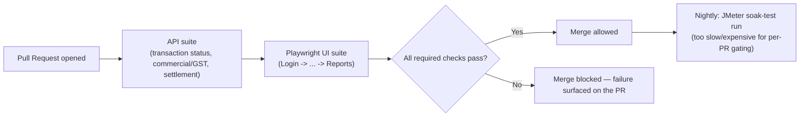

# Collection Engine — Tech Stack & Skills Demonstrated

> Everything in this doc is answerable by reading this repo alone — no need to visit an external
> site to understand what was used or why. This doc is a **skill-oriented index** into content
> that's already documented elsewhere in this repo (business-overview, business-flow,
> feature-modules, service-architecture, performance-test-summary) — it doesn't duplicate that
> content, it cross-references it by *skill* rather than by *product flow*, which none of those
> other docs do.

## 1. Full Tech Stack, and Why Each Tool

| Category | Tool | Why This Tool Specifically |
|---|---|---|
| **UI Automation** | Playwright, TypeScript, Page Object Model | See [`../automation/README.md`](../automation/README.md) for the framework rationale |
| **API Testing & Automation** | Playwright API requests, Postman | Validates transaction status, commercial/GST calculation, and settlement APIs directly against the contract |
| **Test Runner & Reporting** | Playwright Test Runner, built-in HTML Reports | Keeps execution and reporting in one toolchain rather than a separate reporting layer |
| **Performance Testing** | JMeter | Real, executed load testing — see section 5 below and [`../performance-test-summary.md`](../performance-test-summary.md) for the actual results, not an illustrative placeholder |
| **CI/CD** | Jenkins / GitHub Actions | Automates the regression suite on a schedule/trigger |
| **Bug Tracking & Traceability** | JIRA, RTM | Full defect lifecycle tracking plus requirement-to-test-coverage traceability — see [`../sample-rtm.md`](../sample-rtm.md) |
| **Version Control** | Git, GitHub | This repo itself; diagrams throughout `architecture-and-flow.md` are Mermaid, which GitHub renders natively with zero extra tooling |
| **Test Management** | TestRail / Zephyr | Case management for the 64-case regression suite |

## 2. Skills Demonstrated — Skill → Where to See It

| Skill | Demonstrated By | Where to Look |
|---|---|---|
| **Manual / Functional Testing** | Full Login-to-Reports regression suite (64 cases) | [`../regression-checklist.md`](../regression-checklist.md) |
| **API Testing** | Transaction status, commercial/GST, settlement API validation | [`../regression-checklist.md`](../regression-checklist.md) |
| **UI Automation** | Playwright + POM spec covering the highest-priority merchant journey | [`../automation/sample-collection.spec.ts`](../automation/sample-collection.spec.ts) |
| **Performance / Load Testing** | A real 3-hour, 180,000-transaction JMeter soak test with P90/P95/P99 latency and a concrete bottleneck finding (DB connection pool saturation) | [`../performance-test-summary.md`](../performance-test-summary.md) |
| **Service-Boundary / Integration Testing** | Identifying which of ~40 services sit on which integration boundary, and which boundaries are historically defect-prone | [`service-architecture.md`](./service-architecture.md) |
| **Cross-Flow Consistency Testing** | Five independently-failing collection-type flows (UPI/QR/VAM/Payment Link/Manual Deposit), each with its own edge cases | [`business-flow.md`](./business-flow.md) |
| **Requirement Traceability (RTM)** | A worked requirement → test case → status mapping | [`../sample-rtm.md`](../sample-rtm.md) |
| **Defect Management & Root-Cause Analysis** | Worked defects identifying the actual mechanism (two independently-triggered async events; two services reading two different snapshots) rather than just the symptom | [`../sample-defect-report.md`](../sample-defect-report.md); [`architecture-and-flow.md`](./architecture-and-flow.md) |
| **Test Reporting & Metrics** | A structured performance-test report with real throughput/latency numbers, plus 300+ tracked defects end-to-end | [`../performance-test-summary.md`](../performance-test-summary.md) |
| **Technical Documentation & Communication** | The full seven-document `docs/` set, each with a distinct, non-overlapping purpose | [`README.md`](./README.md) |

## 3. The Testing Pyramid Applied to This Project

**Why this pyramid is already backed by real numbers, not just a shape:** per
[`../performance-test-summary.md`](../performance-test-summary.md), the top layer here isn't
illustrative — it's an actual executed test with a concrete finding (database connection pool
saturation as the limiting factor, not application logic). That's worth naming explicitly: the
other repos in this portfolio describe *what* performance testing for their domain would look
like; this one already has a real result to point to.

## 4. CI/CD — Suggested Pipeline Shape

> **Note on scope, matching this repo's existing honesty convention** (see
> [`../automation/README.md`](../automation/README.md)): this repo includes one representative
> Playwright spec rather than the full framework, to stay focused as a portfolio piece. Jenkins/
> GitHub Actions are named in the tech stack as the intended CI tools; the pipeline below is the
> **suggested shape** that automation is designed to slot into.

## 5. Performance Testing — Pointing at the Real Result, Not Repeating It

Rather than re-describing [`../performance-test-summary.md`](../performance-test-summary.md)'s
content here, the useful thing this section can add is *why* those specific metrics were the
right ones to track for this domain:

| Metric Tracked | Why It's the Right One for a Collection Engine Specifically |
|---|---|
| **P99 latency, not just average** | A merchant's dashboard refresh or a customer's payment confirmation being slow in the worst 1% of cases is exactly the experience most likely to generate a support ticket — see [`../docs/business-flow.md`](./business-flow.md)'s point that customer-facing failure modes are this product's highest-value test surface |
| **Database connection pool saturation (the actual finding)** | Settlement Calculation Service queries (section 4 of this doc's pyramid) are concurrency-heavy by nature — many merchants' settlement cycles can land in overlapping windows, which is exactly the pattern that exhausts a connection pool before CPU/application logic becomes the bottleneck |
| **Error rate at sustained volume, not just peak** | A 3-hour soak test (not a short burst) is what actually distinguishes "fine under a quick load spike" from "slowly degrading," which is the more realistic risk for a service merchants depend on continuously, not just during a traffic spike |

## 6. Why This Doc Exists Separately From the Other Six

[`business-overview.md`](./business-overview.md), [`business-flow.md`](./business-flow.md),
[`feature-modules.md`](./feature-modules.md), and [`service-architecture.md`](./service-architecture.md)
are all organized around the *product* — what it is, what happens, what screens exist, what
services run it. This doc is organized around *skills* — so a reader looking for "where's the
performance testing evidence" or "where's the API testing proof" doesn't have to reconstruct that
index themselves from four product-oriented documents.
